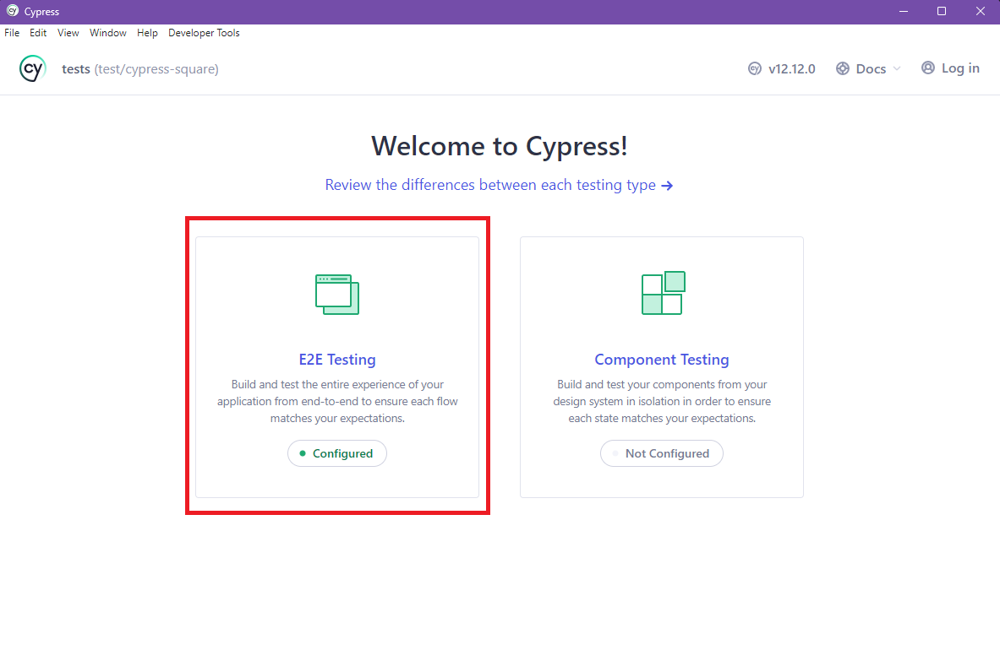
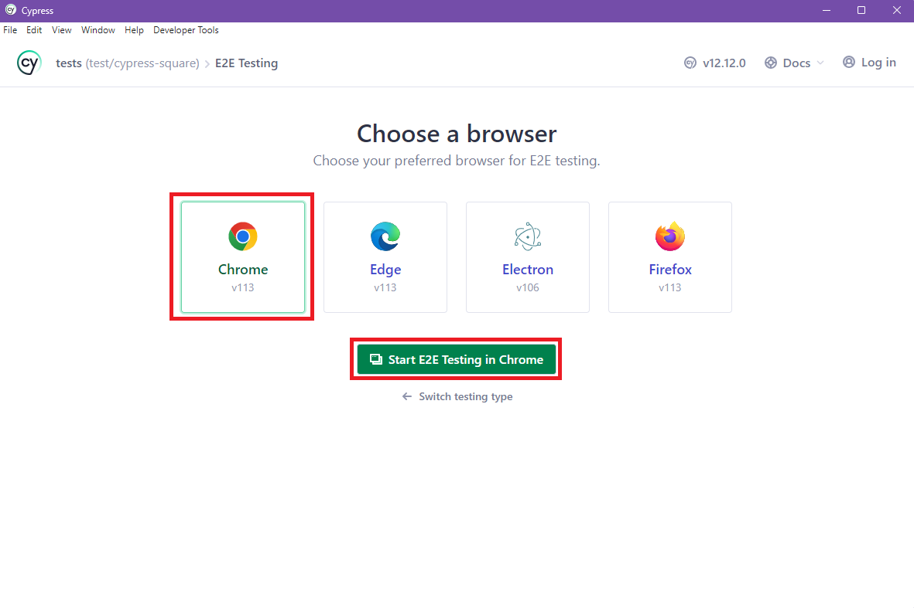
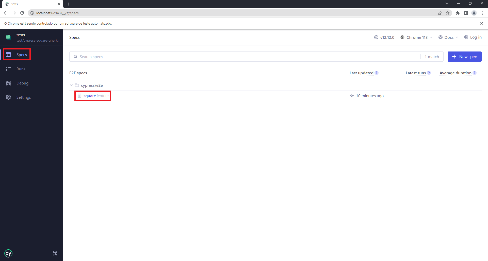
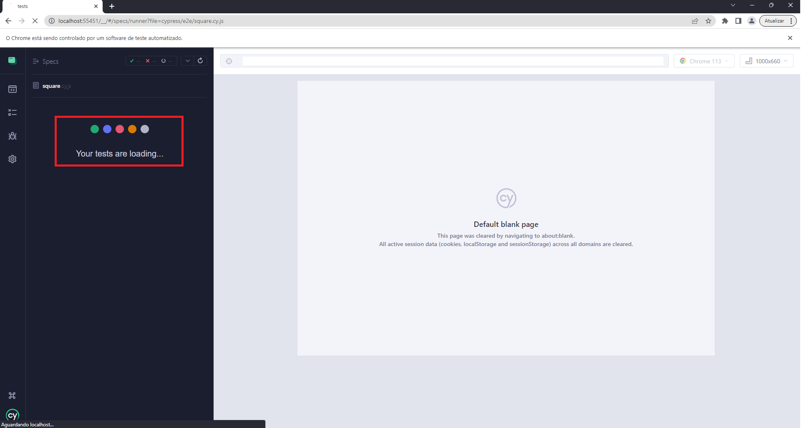
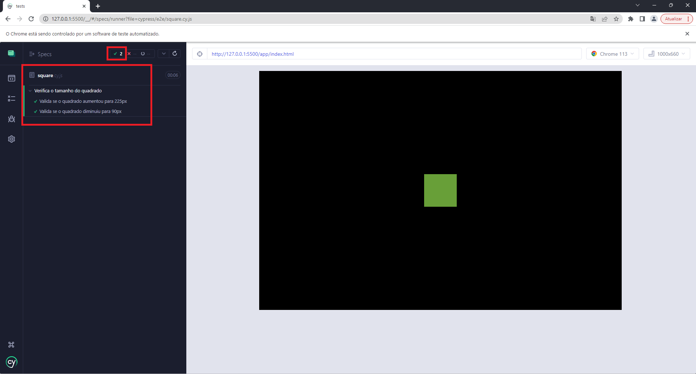
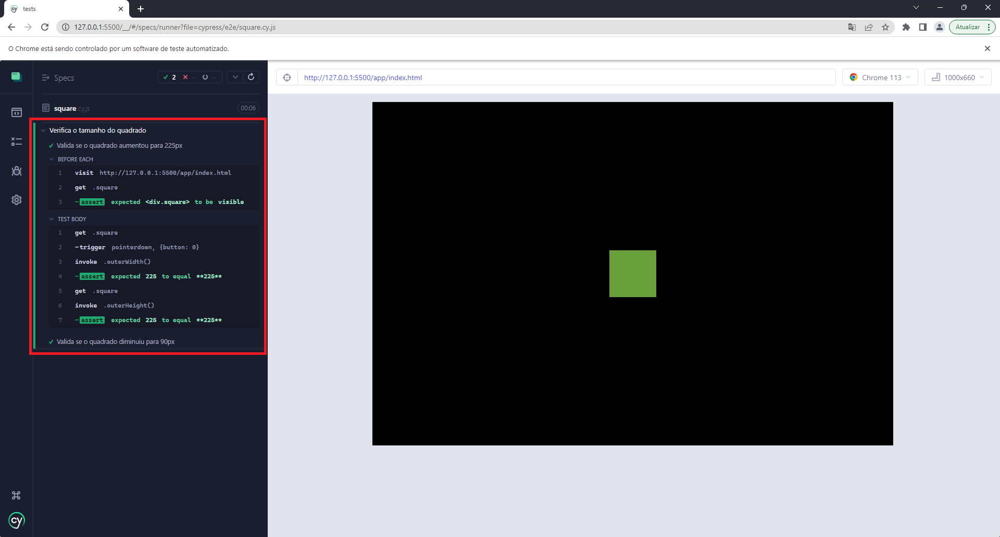

# **Configuração inicial para executar os testes**

**Neste exemplo, utilizei o editor VSCode.**

1. No VSCode, instalar a extensão Live Server
2. Na pasta app, clicar com o botão direito do mouse no arquivo _"index.html"_ e selecionar a opção _"open with live server"_, que abre por padrão a url **"http://127.0.0.1:5500/app/index.html"**.
3. Acessar a pasta "tests" através do terminal e executar o comando _"npm install"_.
4. Após finalizar a instalação das dependências do Cypress, executar o comando _"npx cypress open"_ para abrir a interface gráfica do Cypress ou _"npx cypress run"_ para executar o Cypress via terminal.

## **Como funciona o Cypress**

1. Ao abrir a interface gráfica do Cypress, selecionar a opção **"E2E Testing"**:
   
2. Depois, selecione o navegador no qual deseja executar o teste e clique em _"Start E2E Testing in Chrome"_. Neste exemplo, selecionei o Chrome:
   

3. Após selecionar o navegador, irá abrir uma tela para selecionar o teste que você deseja executar. Neste caso, temos apenas o teste _"square.feature"_. Selecione e aguarde carregar:
   

   

4. Ao final da execução do teste, é possível visualizar que os testes foram executados com sucesso. Ao clicar no nome do teste, você pode visualizar o passo-a-passo executado:
   

   

## **Estrutura do Projeto**

### **Pasta scripts**

Criei a pasta **"scripts"** para adicionar o arquivo _"tap-gesture.js"_ e respeitar a sua referência contida no html conforme mostrava no Codepen.

### **Arquivo index.html**

No arquivo _"index.html"_ adicionei a tag de css para chamar o arquivo css criado com a estrutura de css do codepen, e passei as referências de script para dentro do body para que funcionem corretamente na execução do projeto.

### **Pasta tests**

Na pasta **"tests"** executei o comando _"npx cypress open"_ do Cypress, para que ele criasse um template inicial de estrutura.

No arquivo _"cypress.config.js"_, incluí configurações para que o Cypress não gravasse vídeos ou tirasse prints da tela enquanto rodasse a execução do teste.

### **Pasta page_objects**

Criei a pasta **page_objects** para incluir os arquivos onde são mapeados os elementos da tela.

No arquivo _"square-page.js"_ Exportei o elemento _"square"_, mesmo sabendo que poderia obter o elemento diretamente nos testes, pensando em utilizar nos arquivos de testes de uma forma escalonável.

### **Pasta e2e**

Criei a pasta **e2e** para incluir os arquivos onde são desenvolvidos os testes.

No arquivo _"square.cy.js"_ antes dos testes em si, importei o elemento _"square"_, e defini o acesso à tela do elemento, como também, verficar se o elemento está visível. Optei por este teste, pois, verificar apenas se o elemento existe em tela, não garante que o mesmo esteja visível.

## **Testes**

Decidi fazer dois testes: um para verificar o tamanho do quadrado ao expandir, e outro para verificar o tamanho do quadrado ao retrair.

No teste, para simular o clique longo, utilizei o _"pointerdown"_, ao invés do _"mousedown"_, pois, como a aplicação utiliza o _"hammer.js"_ como biblioteca de eventos, o _"mousedown"_ não realiza nenhuma ação.

Para verificar o tamanho do quadrado, utilizei o método _"invoke"_, com a opção outerWidth e outerHeight, já que estes verificam o tamanho do elemento todo, contendo margin, padding, e border. Vendo a classe _".square"_, poderia ter utilizado o invoke com "css, width/height", mas novamente, pensando numa estrutura mais escalonável, utilizei o outerWidth/Height.

No teste que valida o tamanho do quadrado ao retrair, adicionei um wait de 600ms, para aguardar o tempo de transformação do quadrado de 225px para 90px novamente.

## **Branches**

Na branch _"[main](https://github.com/CinthiaFerraz/DesafioQACypressCinthia/tree/main)"_ deixei apenas a estrutura inicial do projeto.

Na branch _"[test/cypress-square](https://github.com/CinthiaFerraz/DesafioQACypressCinthia/tree/test/cypress-square)"_ está a solução do desafio sem o gherkin.

Na branch _"[test/cypress-square-gherkin](https://github.com/CinthiaFerraz/DesafioQACypressCinthia/tree/test/cypress-square-gherkin)"_ está a solução do desafio com o gherkin.
